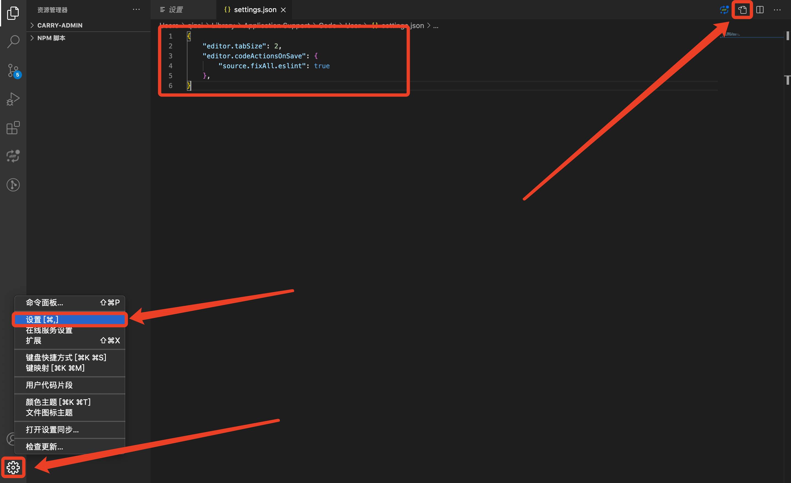

# VUE 开发环境配置

## node

下载并安装: https://nodejs.org/

> 注意： node的安装路径使用默认，最好不要换！！！

## npm 淘宝镜像设置
> 不建议使用 cnpm，会有问题

```sh
npm config set registry https://registry.npm.taobao.org/
```

## Git

安装包淘宝镜像下载地址

```sh
https://npm.taobao.org/mirrors/git-for-windows/
```

## VSCode 开发环境配置

### Eslint 项目依赖
```
prettier
eslint
babel-eslint
eslint-plugin-prettier
eslint-plugin-nuxt
@vue/eslint-config-prettier
@nuxtjs/eslint-config
```

### .eslintrc.js

```js
module.exports = {
  root: true,
  env: {
    browser: true,
    node: true,
    es6: true
  },
  parserOptions: {
    parser: 'babel-eslint'
  },
  extends: [
    '@nuxtjs',
    'prettier',
    'plugin:prettier/recommended'
  ],
  plugins: [
    'prettier'
  ],
  globals: {
  },
  rules: {
    'nuxt/no-cjs-in-config': 0,
    'no-extend-native': 0,
    'new-cap': 0,
    'no-new': 0,
    'vue/no-v-html': 0,
    'unicorn/prefer-starts-ends-with': 0,
    'require-await': 1
  }
}
```

### 插件

```js
// 必须安装
ESLint                          // eslint 插件
Vetur                           // vue 语法插件

// 可选
Auto Close Tag                  // 自动闭合标签
Auto Rename Tag                 // 自动重命名前后标签名称
Bracket Pair Colorizer          // 代码括号颜色插件
HTML CSS Support                // html css 代码提示扩展
JavaScript (ES6) code snippets  // es6 代码提示扩展
GitLens                         // git 行内代码提示
Git History Diff                // git 代码对比插件
```

### 安装后配置eslint，可实现【 Ctrl + S 】自动按照eslint格式化代码风格
> 将以下配置粘贴至【设置】中，然后重启vscode



```json
{
    "editor.tabSize": 2,
    "editor.codeActionsOnSave": {
        "source.fixAll.eslint": true
    },
}
```